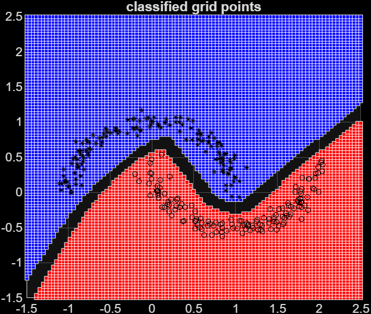
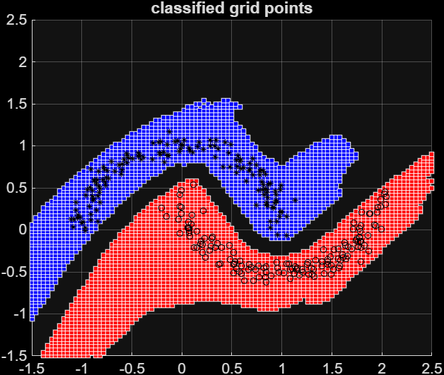
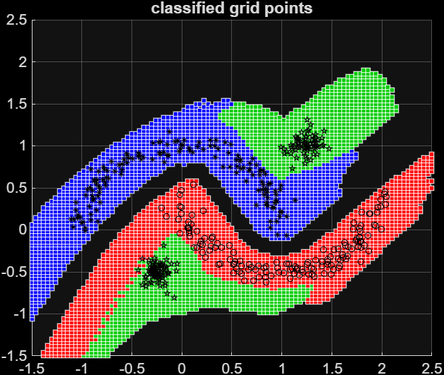
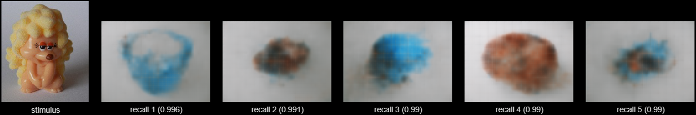

# TopoART Layers

Custom MATLAB deep learning layers that expose [TopoART](https://www.libtopoart.eu/) neural networks (an Adaptive Resonance Theory variant) as drop-in heads for `dlnetwork`. The layers wrap the .NET library [LibTopoART.Compatibility](https://github.com/MarkoTscherepanow/LibTopoART.Compatibility). TopoART is well-suited for tasks that require stable incremental learning after deployment or the ability to detect inputs lying outside the training distribution. Specific TopoART networks add further capabilities; for example, TopoART-AM provides bidirectional associative recall.

## Why TopoART as a layer?

TopoART is **not** trained by gradient descent. It learns incrementally, sample-by-sample, building stable category prototypes (and a topology between them). The confidence it produces is a similarity-to-known-data score, not a normalised softmax probability — so it can flag inputs that lie outside the training distribution instead of extrapolating with high confidence.

Because TopoART is not a deep network, it needs another model as a backbone when raw inputs are unsuitable as features. The typical workflow is:

1. Train a backbone with `trainnet` (gradient descent) using a temporary differentiable head.
2. Strip the temporary head off and **freeze** the backbone.
3. Train a TopoART head on top of the frozen backbone via `trainTopoART` (incremental, online learning — one `learn` call per minibatch).
4. Use the assembled `dlnetwork` for prediction.
5. The TopoART head may be trained whenever required, for instance, if new types of input or output (e.g. classes) are observed.

The layers can also be used standalone, directly behind a `featureInputLayer`, when the raw inputs already form a suitable feature space.

## Requirements

- MATLAB R2024a (or higher) + Deep Learning Toolbox
- .NET runtime: .NET Framework 4.7.2 or higher, or .NET 6.0 or higher

## Getting started

From the [src/](src/) folder, install the .NET dependencies once:

```matlab
installLibs
```

This downloads `LibTopoART.dll` and `LibTopoART.Compatibility.dll` together with their further dependencies (`FSharp.Core.dll` and `System.Numerics.Vectors.dll`) into `src/lib/`. The layer constructors load the assembly on demand.

### Standalone classification example

[classify2dExample.m](src/samples/classify2dExample.m) builds a minimal `dlnetwork` consisting of a `featureInputLayer` followed by a `topoARTClassificationLayer`, trains it on two intertwined spirals (or half-moons), and plots the classified grid:

```matlab
classify2dExample           % default: 'spirals'
classify2dExample('moons')
```
The results demonstrate that (Hypersphere) TopoART-C can easily classify data with complex distributions and is able to reject unknown samples that differ from the known data.

### Backbone + TopoART-C head example

[classifyWithBackbone2dExample.m](src/samples/classifyWithBackbone2dExample.m) runs the full workflow: pretrain a small MLP backbone with `trainnet`, strip the softmax head, train a TopoART-C head on the frozen backbone via `trainTopoART`, and compare both heads on a grid:

```matlab
classifyWithBackbone2dExample          % default: linear scaling
classifyWithBackbone2dExample(false)   % tanh-based normalisation
```

Here, TopoART's capability to reject unknown data is limited by the features it obtains as input. Therefore, two different methods are demonstrated: linear scaling and tanh-based normalisation. While linear scaling preserves this capability, tanh-based normalisation may impair it considerably due to its non-linear nature. On the other hand, linear scaling requires additional processing steps (the slope/offset are fitted once on the trained backbone's outputs, then frozen and clipped to `[0, 1]`) which can be omitted for tanh-based normalisation. The choice depends on whether rejection of unknown input or implementation simplicity matters more for the application at hand.

The figures below show the results for the default settings (linear scaling). Coloured squares are classified grid points; grid points rejected by the confidence threshold are left blank. Black markers denote the training samples. The original softmax head (left) extrapolates and assigns almost the entire grid to one of the two classes with high confidence. The TopoART-C head (centre) only labels grid points that resemble the training data and rejects the rest. After incremental training with a third class shown in green (right), the TopoART-C head recognises the new class without forgetting the two original ones.

| Original softmax head | TopoART-C head | After incremental training |
| :---: | :---: | :---: |
|  |  |  |

### Associative memory (TopoART-AM) examples

Beyond classification, the layer [topoARTAssociativeMemoryLayer.m](src/topoARTAssociativeMemoryLayer.m) wraps a TopoART-AM network and acts as a bidirectional associative memory. It learns associations between pairs of key vectors. The association is symmetric: after training, either key can be presented to recall the other. The recall direction is selected by the layer's `Direction` property and can be switched between prediction calls without rebuilding the layer or the `dlnetwork`. Recall is a 1-to-n mapping: within a `dlnetwork`, `predict` returns the strongest association together with its activation (a confidence score), while the layer's `recall` method returns the associated keys of a stimulus in order of descending F3 activation. It may return the complete set, but it is usually stopped earlier — by a minimum activation (and optionally a maximum number of recalls) — so that only strongly associated keys are returned.

Two samples associate two kinds of images, owners and objects, with an m-to-n mapping between them: each owner can be associated with several objects and an object can be shared by several owners. From the [src/samples/](src/samples/) folder, download the image dataset once:

```matlab
getDatasets
```

[associateImagesExample.m](src/samples/associateImagesExample.m) uses the raw images themselves as keys (with the uint8 interface type, the pixels are passed as integers in `[0, 255]`) and trains the layer directly through its `learn` method. Presenting a test owner recalls its associated objects, and presenting a test object recalls its owners. TopoART-AM does not just store the training images but learns internal representations called categories; the recalled images are created from these categories and usually combine information from several training images.

```matlab
associateImagesExample
```

[associateImagesWithAutoencodersExample.m](src/samples/associateImagesWithAutoencodersExample.m) demonstrates the backbone workflow for associative memories: one convolutional autoencoder is trained per key with `trainnet` (gradient descent), the frozen encoders serve as backbones, and the TopoART-AM head learns associations between the compact latent codes via `trainTopoARTAM` (incremental TopoART learning). Each recalled latent code is decoded back into an image by the matching decoder; no training images are needed at inference. Compressing each image into a few latent variables makes the associations far more robust to small input perturbations than the raw-pixel keys, at comparable recall quality on clean data.

```matlab
associateImagesWithAutoencodersExample
```

The figure below shows the recall direction owner -> objects for a held-out test owner. The frozen owner encoder turns the stimulus (left) into a latent key, the TopoART-AM head recalls the latent keys of the associated objects in order of descending activation (in parentheses), and the object decoder turns each recalled key back into an image. The recalled images stem from the learnt categories rather than from stored training images: each category encodes a subspace of TopoART's input space (here, the latent key space) that summarises several similar training keys, and a recall returns the centre of gravity of this subspace, so the decoded images average several training views; the remaining blur is the autoencoder's own reconstruction loss.



## Important constraints

- **Input range.** TopoART requires every input to lie in `[0, 1]`. Decide the transform **before** training TopoART and apply the identical mapping at training and inference time. Two options:
    - **Self-bounding map** baked into the backbone, e.g., `functionLayer(@(x) 0.5 + 0.5*tanh(x))` (range `(0, 1)`) or `sigmoidLayer`. Simple and bound-safe but saturation can hide out-of-distribution points.
    - **Element-wise affine fit** of the backbone's outputs to an inner sub-interval such as `[0.25, 0.75]`, clipped to `[0, 1]` for inputs drifting outside the training distribution. Fit slope/offset **once** after backbone training and freeze them into the network — do not auto-rescale at inference.

    Hypersphere TopoART is less strict wrt. the scaling interval. Larger intervals need to be reflected by larger values of the radial extend parameter `R`.
- **Frozen backbone.** When training on top of a backbone, the backbone must be frozen. TopoART builds stable prototypes called categories in the feature space; if that space shifts, the categories become invalid.
- **No `trainnet` for TopoART layers.** Train them via the layer's `learn` method (standalone), `trainTopoART` (with a backbone), or `trainTopoARTAM` (associative memory with two backbones).

## Related information and background

- LibTopoART homepage: https://www.libtopoart.eu/
- LibTopoART (.NET): https://github.com/MarkoTscherepanow/LibTopoART
- LibTopoART.Compatibility (.NET wrapper used here):
  https://github.com/MarkoTscherepanow/LibTopoART.Compatibility
- TopoART neural networks (MATLAB package; some helpers are reused here):
  https://de.mathworks.com/matlabcentral/fileexchange/118455-topoart-neural-networks
